# GBMirroring

**Stream Pokémon Emerald from an unmodified GBA SP to a local web browser through a Raspberry Pi Pico and the Link port.**

[English](#english) · [Italiano](README.it.md) · [Quick start](docs/QUICKSTART.en.md) · [How it works](docs/ARCHITECTURE.md) · [Test evidence](test-results/software-v0.11.0/summary.json)

## English

GBMirroring is an experimental hardware/software project for displaying gameplay from a real Game Boy Advance cartridge on a PC. The game runs on the handheld; a small resident program exports graphics state through the Link cable, and the PC reconstructs the image for a local browser and OBS.

**Concept and project direction: hacke & Lain. Development of GBMirroring was carried out entirely with AI, using GPT 6 Astra.** Hardware assembly, testing, feedback and project decisions are human contributions. Third-party code and hardware designs remain credited to their original authors; the AI-development statement does not claim authorship of those projects.

This early release shares working code, ready-to-run tools and measured limitations. **It does not yet provide a stable 30 FPS stream in every scene.**

Package **0.11.1** updates publication documentation, licenses and source provenance. Streaming binaries remain resident **0.11.0** and Pico **0.7.0**. Project-owned code is [GPL-3.0](LICENSE); see [third-party notices](THIRD_PARTY.md) for dependencies and source access.

## What works today

- Real-cartridge streaming has been tested on **GBA SP + original Italian Pokémon Emerald, BPEI revision 0**.
- An **RP2040 Raspberry Pi Pico** adapter handles both multiboot and streaming with one installed firmware. No firmware swap is needed during a session.
- A portable Windows x64 application opens a local web viewer. OBS can capture the clean browser view.
- Graphics updates use a cache, deltas, compression, integrity checks and automatic recovery.
- Gameplay and audio on the handheld remained fluid in recent user hardware tests. This does not imply that the browser has the same frame rate.

The public documentation is English-first, with an Italian counterpart. Some historical development notes and existing command-line prompts are still in Italian; the English quick start explains the prompts used by the current launcher.

## Supported setup

| Component | Current target |
|---|---|
| Handheld | GBA SP; wider GBA compatibility is not certified |
| Cartridge | Original Italian Pokémon Emerald, BPEI rev. 0 |
| Adapter | RP2040 Pico on the [agtbaskara Link adapter design](https://github.com/agtbaskara/game-boy-pico-link-board) |
| Cable | Tested GBA Link cable with hub, smaller plug at adapter, larger plug at GBA; GBA selector position |
| PC | Windows 10/11 x64, USB data connection, web browser |
| Software | Emerald resident 0.11.0, unified Pico firmware 0.7.0 |

No internal console modification is required. The current Italian cartridge profile contains revision-specific addresses and a cartridge check. Other Emerald languages, FireRed/LeafGreen, GB/GBC games and arbitrary cartridges are **not supported by this release**. Do not assume another adapter or cable has the same signal routing.

## Quick start

1. Download the complete repository ZIP from **Code → Download ZIP**, then extract it into a writable folder. Do not run a BAT from inside the ZIP.
2. If your adapter does not already use our unified 0.7.0 firmware, hold the Pico's BOOTSEL button while connecting USB and copy `dist/gbmirroring-unified-v0.7.0.uf2` to its drive. This is a one-time step for this release.
3. Start the GBA without a cartridge. Run **`14-AVVIA-SMERALDO.bat`** and press **Enter** to load the resident via multiboot.
4. When the handheld requests it, insert your Italian Emerald cartridge, press **START**, and enter your game.
5. Once the PC says **PRONTO** (ready), press **SELECT + L + R** on the GBA. The viewer opens at **http://127.0.0.1:8765**. Leave the BAT running.

The package contains the portable Python runtime, USB libraries, renderer and compiled homebrew/UF2 files. Users do not need to compile, provide a game ROM to the PC, or install the private development folder.

For OBS, use a Browser Source at **http://127.0.0.1:8765/?clean=1**, sized 240 × 160 or an integer multiple. The browser buffers approximately 200 ms. The current viewer does not stream game audio.

[Full setup, recovery and test instructions →](docs/QUICKSTART.en.md)

## How it works

```mermaid
flowchart LR
    A[PC multiboot loader] --> B[Pico: boot mode]
    B --> C[GBA resident in RAM]
    C --> D[Real cartridge gameplay]
    D --> E[Graphics registers, palette, OAM and VRAM updates]
    E --> F[Link GPIO protocol]
    F --> G[Pico: receive mode]
    G --> H[USB CDC to PC]
    H --> I[Verified graphics cache and mGBA-based renderer]
    I --> J[Local browser / OBS]
```

The Link port does not expose a raw LCD video signal. Our resident observes graphics activity in the running game and sends changes to the PC. The host renderer uses those graphics resources to draw the image; it does not run a second copy of the game from a commercial ROM.

The 0.11.0 resident adds small column-group patches for map updates during scrolling. The PC validates the reconstructed block before accepting it. The Pico remains compatible because it transports the packet stream without needing to understand every graphics codec.

See [architecture and source map](docs/ARCHITECTURE.md) for the memory budget, protocol and current limitations.

## Performance: measurements, not promises

| Evidence | Result | What it means |
|---|---|---|
| 0.10.0 physical session | 20.16 received frames/s average, with severe outdoor walking stalls | Real Link capture; the overall average hides bad intervals |
| 0.11.0, emulated horizontal walking in Sootopolis | 13.64 → 21.35 captures/s against 0.10.0 | Same controlled scenario; **not a physical browser FPS measurement** |
| 0.11.0, emulated game Main callback | 1198 updates / 1200 frames, with and without capture | Gameplay progress checked independently of capture rate |
| 0.11.0, ARM protocol replay | 120 / 120 frozen scenes reconstructed byte-for-byte | Codec correctness; does not prove live temporal coherence |

At the time of this publication preparation, a physical 0.11.0 test has not been recorded. Menus, battles, scene transitions and busy outdoor areas can reduce the streaming rate. Scanline effects are incomplete. No interpolated frames or repeated browser refreshes are counted as newly received game frames.

[Hardware journal (Italian)](docs/VALIDAZIONE-HARDWARE.md) · [Selected software results](test-results/software-v0.11.0/summary.json) · [Current limitations / roadmap](docs/ARCHITECTURE.md#roadmap)

## Project background and credits

The work grew from hacke and Lain's experiments with Link adapters, online connectivity and a separate Emerald cooperative-play project. A future repository integration is planned. **The cooperative-play software is not bundled or advertised as implemented by GBMirroring today.**

We build on community work, including:

- [agtbaskara/game-boy-pico-link-board](https://github.com/agtbaskara/game-boy-pico-link-board): adapter hardware design.
- [Celio-Link](https://github.com/Celio-Link): Link transport, multiboot background and the source of the adapted multiplayer PIO sequence.
- The project's supplied `mb_multi.py` and `usb_link.py` modules: preserved with their authorship, used with the contributors' permission.
- [pret/pokeemerald](https://github.com/pret/pokeemerald): understanding game structures and graphics updates.
- [mGBA](https://github.com/mgba-emu/mgba): graphics rendering and local development validation.
- Raspberry Pi Pico SDK, TinyUSB, Python, PyUSB, libusb and their contributors.

See [THIRD_PARTY.md](THIRD_PARTY.md) for attribution and distribution status. No commercial game ROMs or saves are included. Pokémon and Nintendo names identify compatibility; this is an independent project without affiliation or endorsement. Publication documents this project's work and history, not a claim of exclusive invention or priority over other projects.

## Repository guide

| Path | Purpose |
|---|---|
| `firmware/emerald-columns/` | Current cartridge resident and multiboot loader sources |
| `firmware/unified/` | Pico boot + streaming firmware |
| `tools/` | Launcher, protocol, viewer, builders and tests |
| `native/renderer/` | Renderer bridge and corresponding mGBA source archive |
| `runtime/` | Portable Windows dependencies and their notices |
| `dist/` | Versioned binaries and verification manifests |
| `test-results/` | Selected, reviewed test evidence |
| `docs/` | Setup, architecture and development records |

To help: report the version, adapter/cable, cartridge language/revision and the scene that fails. Review reports before uploading: raw logs may contain local paths or device identifiers. Never attach a commercial ROM or save. See [CONTRIBUTING.md](CONTRIBUTING.md).
