# GBMirroring

**Stream Pokémon Emerald from an unmodified GBA SP to a local web browser through a Raspberry Pi Pico and the Link port.**

[English](#english) · [Italiano](README.it.md) · [Quick start](docs/QUICKSTART.en.md) · [How it works](docs/ARCHITECTURE.md) · [Test evidence](test-results/software-v0.12.0/summary.json)

## English

GBMirroring is an experimental hardware/software project for displaying gameplay from a real Game Boy Advance cartridge on a PC. The game runs on the handheld; a small resident program exports graphics state through the Link cable, and the PC reconstructs the image for a local browser and OBS.

**Concept and project direction: hacke & Lain. Development of GBMirroring was carried out entirely with AI, using GPT 6 Astra.** Hardware assembly, testing, feedback and project decisions are human contributions. Third-party code and hardware designs remain credited to their original authors; the AI-development statement does not claim authorship of those projects.

This early release shares working code, ready-to-run tools and measured limitations. **Version 0.12.0 changes the stream to one packet per game frame; it has been verified only with an emulated game and the real resident code, not yet on a physical console.**

Package **0.12.1** carries resident **0.12.1** and the unchanged Pico firmware **0.7.0**. Project-owned code is [GPL-3.0](LICENSE); see [third-party notices](THIRD_PARTY.md) for dependencies and source access.

## What works today

- Real-cartridge streaming has been tested on **GBA SP + original Italian Pokémon Emerald, BPEI revision 0**.
- An **RP2040 Raspberry Pi Pico** adapter handles both multiboot and streaming with one installed firmware. No firmware swap is needed during a session.
- A portable Windows x64 application opens a local web viewer. OBS can capture the clean browser view.
- Graphics updates use a cache, deltas, integrity checks and automatic recovery. Copies the game takes from its own ROM are replayed by the PC from a local image of your cartridge, created once by the GBA (about three minutes, first run only).
- Gameplay and audio on the handheld remained fluid in recent user hardware tests. This does not imply that the browser has the same frame rate.

The public documentation is English-first, with an Italian counterpart. Some historical development notes and existing command-line prompts are still in Italian; the English quick start explains the prompts used by the current launcher.

## Supported setup

| Component | Current target |
|---|---|
| Handheld | GBA SP; wider GBA compatibility is not certified |
| Cartridge | Original Italian Pokémon Emerald, BPEI rev. 0 |
| Adapter | RP2040 Pico on the [agtbaskara Link adapter design](https://github.com/agtbaskara/game-boy-pico-link-board) |
| Cable | Tested GBA Link cable with hub, smaller plug at adapter, larger plug at GBA; GBA selector position |
| PC | Windows 10/11 x64, USB data connection, web browser |
| Software | Emerald resident 0.12.1, unified Pico firmware 0.7.0 |

No internal console modification is required. The current Italian cartridge profile contains revision-specific addresses and a cartridge check. Other Emerald languages, FireRed/LeafGreen, GB/GBC games and arbitrary cartridges are **not supported by this release**. Do not assume another adapter or cable has the same signal routing.

## Quick start

1. Download the complete repository ZIP from **Code → Download ZIP**, then extract it into a writable folder. Do not run a BAT from inside the ZIP.
2. If your adapter does not already use our unified 0.7.0 firmware, hold the Pico's BOOTSEL button while connecting USB and copy `dist/gbmirroring-unified-v0.7.0.uf2` to its drive. This is a one-time step for this release.
3. **First run only:** start the GBA without a cartridge, run **`14-AVVIA-SMERALDO.bat`**, press **Enter**, insert your Italian Emerald when asked and press **A** (not START). The GBA copies the cartridge to `runtime/cache/` on the PC in about three minutes. Restart the GBA when the PC says the cache was saved.
4. Start the GBA without a cartridge. Run **`14-AVVIA-SMERALDO.bat`** and press **Enter** to load the resident via multiboot.
5. When the handheld requests it, insert your Italian Emerald cartridge, press **START**, and enter your game.
6. Once the PC says **PRONTO** (ready), press **SELECT + L + R** on the GBA. The viewer opens at **http://127.0.0.1:8765**. Leave the BAT running.

The package contains the portable Python runtime, USB libraries, renderer and compiled homebrew/UF2 files. Users do not need to compile, provide a game ROM to the PC, or install the private development folder.

For OBS, use a Browser Source at **http://127.0.0.1:8765/?clean=1**, sized 240 × 160 or an integer multiple. The browser buffers approximately 200 ms. The current viewer does not stream game audio.

[Full setup, recovery and test instructions →](docs/QUICKSTART.en.md)

## How it works

```mermaid
flowchart LR
    A[PC multiboot loader] --> B[Pico: boot mode]
    B --> C[GBA resident in RAM]
    C --> D[Real cartridge gameplay]
    D --> E[Graphics registers, palette, OAM and VRAM updates]
    E --> F[Link GPIO protocol]
    F --> G[Pico: receive mode]
    G --> H[USB CDC to PC]
    H --> I[Verified graphics cache and mGBA-based renderer]
    I --> J[Local browser / OBS]
```

The Link port does not expose a raw LCD video signal. Our resident observes graphics activity in the running game and sends changes to the PC. The host renderer uses those graphics resources to draw the image; it does not run a second copy of the game from a commercial ROM.

The 0.12.0 resident sends one packet per game frame: registers, palette and OAM every time, plus as many changed VRAM blocks as fit in a small time budget; the rest is reported as pending and follows. The PC keeps frames in order until the pending blocks arrive, and the browser's 200 ms buffer absorbs the difference. Map scrolling is sent as a single column pair (or row pair) per layer, and ROM-sourced copies as five-word references confirmed word by word on the GBA. The resident yields to the game: it skips a frame when the game is still busy at VBlank. `SELECT + R + A` lowers the capture cadence if the console ever slows down. The Pico remains compatible because it transports the packet stream without needing to understand it.

See [architecture and source map](docs/ARCHITECTURE.md) for the memory budget, protocol and current limitations.

## Performance: measurements, not promises

All 0.12.0 numbers below come from the real resident code running with an **emulated** game and a cycle model, decoded by the PC receiver; they are not physical measurements.

| Evidence | Result | What it means |
|---|---|---|
| 0.10.0 physical session | 20.16 received frames/s average, with severe outdoor walking stalls | Real Link capture; the average hides bad intervals |
| 0.12.0, emulated standing / walking / vertical walking / running | 60 stream frames per 60 game frames; 96-100% of frames pixel-identical to the emulated frame (standing 100%, walking 99%, vertical 97.5%, running 96%), worst second 56-60 frames | The stream keeps pace in the model; small differences are tiles that arrive a few frames late |
| 0.12.0, emulated game main loop with the resident (mGBA timing) | 1197 / 1198 iterations walking and 1197 / 1198 running (unmodified game 1198) | The game's own pace is preserved in emulation; audio is not measured |
| 0.12.0, emulated menu open/close | seconds of held image while about 170 blocks of tile data reload | Scene loads are still slow: known limit |
| 0.12.0, physical | **not recorded yet** | Link timing, audio and browser presentation must be verified on a console |

Physical results from 0.11.0 or earlier do not apply. Refresh rate of the browser, stream frames and GBA gameplay are separate measurements; interpolated or repeated frames are never counted as new stream frames.

[Hardware journal (Italian)](docs/VALIDAZIONE-HARDWARE.md) · [Selected software results](test-results/software-v0.12.0/summary.json) · [Current limitations / roadmap](docs/ARCHITECTURE.md#roadmap)

## Project background and credits

The work grew from hacke and Lain's experiments with Link adapters, online connectivity and a separate Emerald cooperative-play project. A future repository integration is planned. **The cooperative-play software is not bundled or advertised as implemented by GBMirroring today.**

We build on community work, including:

- [agtbaskara/game-boy-pico-link-board](https://github.com/agtbaskara/game-boy-pico-link-board): adapter hardware design.
- [Celio-Link](https://github.com/Celio-Link): Link transport, multiboot background and the source of the adapted multiplayer PIO sequence.
- The project's supplied `mb_multi.py` and `usb_link.py` modules: preserved with their authorship, used with the contributors' permission.
- [pret/pokeemerald](https://github.com/pret/pokeemerald): understanding game structures and graphics updates.
- [mGBA](https://github.com/mgba-emu/mgba): graphics rendering and local development validation.
- Raspberry Pi Pico SDK, TinyUSB, Python, PyUSB, libusb and their contributors.

See [THIRD_PARTY.md](THIRD_PARTY.md) for attribution and distribution status. No commercial game ROMs or saves are included. Pokémon and Nintendo names identify compatibility; this is an independent project without affiliation or endorsement. Publication documents this project's work and history, not a claim of exclusive invention or priority over other projects.

## Repository guide

| Path | Purpose |
|---|---|
| `firmware/emerald-stream/` | Current cartridge resident and multiboot loader sources (`emerald-columns` is the 0.11.0 baseline) |
| `firmware/unified/` | Pico boot + streaming firmware |
| `tools/` | Launcher, protocol, viewer, builders and tests |
| `native/renderer/` | Renderer bridge and corresponding mGBA source archive |
| `runtime/` | Portable Windows dependencies and their notices |
| `dist/` | Versioned binaries and verification manifests |
| `test-results/` | Selected, reviewed test evidence |
| `docs/` | Setup, architecture and development records |

To help: report the version, adapter/cable, cartridge language/revision and the scene that fails. Review reports before uploading: raw logs may contain local paths or device identifiers. Never attach a commercial ROM or save. See [CONTRIBUTING.md](CONTRIBUTING.md).
